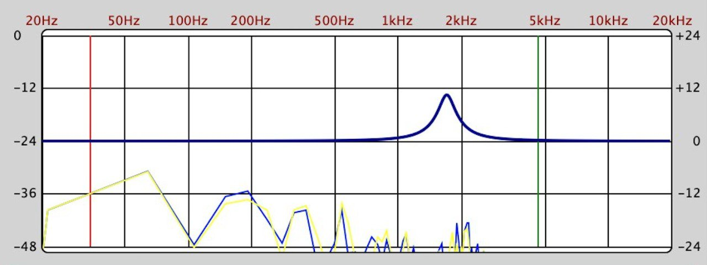
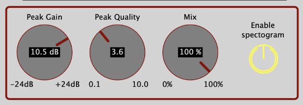

<!-- PROJECT SHIELDS -->
[![Contributors][contributors-shield]][contributors-url]
[![Forks][forks-shield]][forks-url]
[![Stargazers][stars-shield]][stars-url]

<!-- PROJECT LOGO -->

 

  

<h3 align="center">YetAnotherAutoWah</h3>

  

   AutoWahWah plugin
     
    <a href="https://github.com/polimi-cmls-22/group7-HW-Juce-Radical_Geeks"><strong>Explore the docs»</strong></a>
     
     
 
  

<!-- TABLE OF CONTENTS -->

  
Table of Contents

  <ol>
    <li>
      <a href="#about-the-project">About The Project</a>
      <ul>
        <li><a href="#built-with">Built With</a></li>
      </ul>
    </li>
    <li>
      <a href="#getting-started">Getting Started</a>
      <ul>
        <li><a href="#prerequisites">Prerequisites</a></li>
        <li><a href="#installation">Installation</a></li>
      </ul>
    </li>
    <li><a href="#GUI">GUI</a></li>
    <li><a href="#roadmap">Roadmap</a></li>
    <li><a href="#contact">Contact</a></li>

  </ol>

<!-- ABOUT THE PROJECT -->
## About The Project
The aim of this project is to implement a wah-wah effect plugin. The wah-wah effect consists in a passband filter, whose central frequency varies over time in a prescribed range and according to a modulating function that can be modified by a knob.
The input of the plugin is a signal (e.g. an instrument, a song, a midi instrument), and the output is the signal modified after applying the wah-wah effect. The user can choose the parameters by interacting with the GUI.

(<a href="#top">back to top</a>)

### Built With

* [Juce](https://juce.com/)

(<a href="#top">back to top</a>)

<!-- GETTING STARTED -->
## Getting Started

### Prerequisites
You need Juce and an IDE.
 If you're a Windows user, it's recommended to use the latest version of Visual Studio. If you're a Max user, it's recommended to use the latest version of xCode.

### Installation
1. Download for free Juce at [https://juce.com/get-juce]
2. Clone this repo
3. Open the project with Juce
4. Launch your IDE from Juce
5. Save and open the project in the IDE through the Projucer button
6. Build the plugin as standalone, vst3 or component
7. Use the plugin along with your favorite DAW

(<a href="#top">back to top</a>)

<!-- GUI -->
## GUI

The plugin is made of three main parts: an upper section, a middle section and a lower section.
 The upper section includes (from left to rigth) :
1. a knob to control the lower limit of the sweep (value in the [0.5 Hz, 20kHz] range);
2. a knob to control the upper limit of the sweep (value in the [0.5 Hz, 20kHz] range);
3. a knob to control the frequency of the sweep function (value in the [0.5 Hz, 20] range);
4. a drop-down menu to choose the sweep signal (sine wave, triangle wave, sawtooth wave, inverted sawtooth wave and rectangle wave). 

 

The middle section contains the frequency analyzer. It shows the frequency response of the peak filter and, if the user enables this option, also the FFT of the input (stereo).

 

The lower section is made of (from left to rigth) :
1. a knob to control the peak gain of the filter (value in the [-24 dB, +24 dB] range);
2. a knob to control the peak quality of the filter (value in the [0.1, 10] range);
3. a knob to control the wet/dry ratio (value in the [0%, 100%] range);
4. a button to enable the visualization of the FFT of the input in the frequency analyzer.

 

(<a href="#top">back to top</a>)

<!-- ROADMAP -->
## Roadmap

- [✓] implement a peak filter
- [✓] let the central frequency of the peak filter change with a function
- [✓] implement the sweep signals
- [✓] let the user change the parameters of the peak filter (Q and gain)
- [✓] let the user change the parameters of the sweep (limits and frequency)
- [✓] frequency analyzer

(<a href="#top">back to top</a>)

<!-- CONTACT -->
## Contact

Gerardo Cicalese - (gerardo.cicalese@mail.polimi.it) 

Alberto Bollino - (alberto.bollino@mail.polimi.it) 

Umberto Derme - (umberto.derme@mail.polimi.it) 

Giorgio Granello - (giorgio.granello@mail.polimi.it) 

Project Link: [https://github.com/polimi-cmls-22/group7-HW-Juce-Radical_Geeks](https://github.com/polimi-cmls-22/group7-HW-Juce-Radical_Geeks)

(<a href="#top">back to top</a>)

<!-- MARKDOWN LINKS & IMAGES -->
<!-- https://www.markdownguide.org/basic-syntax/#reference-style-links -->
[contributors-shield]: https://img.shields.io/github/contributors/polimi-cmls-22/group7-hw-Juce-Radical_Geeks.svg?style=for-the-badge
[contributors-url]: https://github.com/polimi-cmls-22/group7-hw-Juce-Radical_Geeks/graphs/contributors
[forks-shield]: https://img.shields.io/github/forks/polimi-cmls-22/group7-hw-Juce-Radical_Geeks.svg?style=for-the-badge
[forks-url]: https://github.com/polimi-cmls-22/group7-hw-Juce-Radical_Geeks/network/members
[stars-shield]: https://img.shields.io/github/stars/polimi-cmls-22/group7-hw-Juce-Radical_Geeks.svg?style=for-the-badge
[stars-url]: https://github.com/polimi-cmls-22/group7-hw-Juce-Radical_Geeks/stargazers
